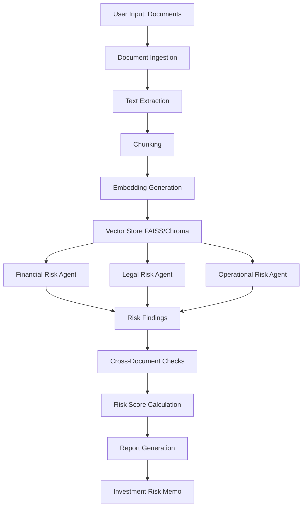

# Design Document: AI Due Diligence Engine

## Overview

The AI Due Diligence Engine is a Python-based system that performs automated investment risk analysis on business documents. The system uses a RAG (Retrieval-Augmented Generation) architecture with lightweight agentic AI to analyze documents across three risk dimensions: Financial, Legal, and Operational.

The architecture follows a pipeline pattern:
1. **Ingestion**: Documents → Text Extraction → Chunking → Embeddings → Vector Store
2. **Analysis**: Risk Agents query Vector Store → LLM Analysis → Risk Findings with Evidence
3. **Cross-Validation**: Heuristic checks detect inconsistencies across documents
4. **Reporting**: Aggregate findings → Calculate risk score → Generate structured markdown memo

The system prioritizes simplicity, readability, and educational value over production-scale optimization.

## Architecture

### High-Level Architecture



### Module Architecture

The system is organized into six core modules:

1. **ingest.py**: Document loading, text extraction, chunking, embedding generation, and vector store initialization
2. **retriever.py**: Vector similarity search and chunk retrieval with metadata
3. **agents.py**: Three specialized risk analysis agents (Financial, Legal, Operational)
4. **cross_checks.py**: Rule-based inconsistency detection across documents
5. **report.py**: Risk memo generation and formatting
6. **main.py**: Orchestration and CLI entry point

### Technology Stack

- **Language**: Python 3.9+
- **LLM Framework**: LangChain
- **LLM Provider**: OpenAI (GPT-4 or GPT-4.1)
- **Vector Store**: FAISS (local, file-based persistence)
- **Embeddings**: OpenAI text-embedding-ada-002
- **Document Processing**: PyPDF2 or pdfplumber for PDF extraction
- **Dependencies**: langchain, openai, faiss-cpu, pypdf2

## Components and Interfaces

### 1. Document Ingestion Module (ingest.py)

**Purpose**: Load documents, extract text, create chunks, generate embeddings, and populate vector store.

**Key Functions**:

```python
def load_documents(file_paths: List[str]) -> List[Document]:
    """
    Load documents from file paths.
    
    Args:
        file_paths: List of paths to PDF or text files
    
    Returns:
        List of Document objects with content and metadata
    """
    pass

def chunk_documents(documents: List[Document], chunk_size: int = 1000, 
                    chunk_overlap: int = 200) -> List[Document]:
    """
    Split documents into chunks for embedding.
    
    Args:
        documents: List of Document objects
        chunk_size: Maximum characters per chunk
        chunk_overlap: Overlap between consecutive chunks
    
    Returns:
        List of chunked Document objects with preserved metadata
    """
    pass

def create_vector_store(chunks: List[Document], 
                       embeddings_model: Embeddings) -> VectorStore:
    """
    Generate embeddings and create FAISS vector store.
    
    Args:
        chunks: List of document chunks
        embeddings_model: OpenAI embeddings model
    
    Returns:
        FAISS vector store with indexed chunks
    """
    pass
```

**Metadata Structure**:
Each chunk maintains:
- `source`: Original document filename
- `page`: Page number (for PDFs) or section identifier
- `chunk_id`: Unique identifier for the chunk

### 2. Retrieval Module (retriever.py)

**Purpose**: Query vector store and retrieve relevant chunks with metadata.

**Key Functions**:

```python
def retrieve_relevant_chunks(vector_store: VectorStore, 
                            query: str, 
                            k: int = 5) -> List[Tuple[Document, float]]:
    """
    Retrieve top-k most relevant chunks for a query.
    
    Args:
        vector_store: FAISS vector store
        query: Search query string
        k: Number of chunks to retrieve
    
    Returns:
        List of (Document, similarity_score) tuples
    """
    pass

def format_chunks_with_citations(chunks: List[Tuple[Document, float]]) -> str:
    """
    Format retrieved chunks with source citations.
    
    Args:
        chunks: List of (Document, similarity_score) tuples
    
    Returns:
        Formatted string with content and citations
    """
    pass
```

### 3. Risk Analysis Agents Module (agents.py)

**Purpose**: Implement three specialized agents that analyze specific risk categories.

**Agent Base Class**:

```python
class RiskAgent:
    """Base class for risk analysis agents."""
    
    def __init__(self, agent_type: str, llm: BaseLLM, vector_store: VectorStore):
        self.agent_type = agent_type
        self.llm = llm
        self.vector_store = vector_store
    
    def analyze(self, query_templates: List[str]) -> List[RiskFinding]:
        """
        Analyze documents for specific risk category.
        
        Args:
            query_templates: List of query strings for retrieval
        
        Returns:
            List of RiskFinding objects with evidence
        """
        pass
```

**Specialized Agents**:

```python
class FinancialRiskAgent(RiskAgent):
    """
    Analyzes financial risks including revenue claims, growth projections,
    cost structures, and missing financial data.
    
    Query Focus Areas:
    - Revenue and growth statements
    - Cost structures and burn rate
    - Financial projections and assumptions
    - Missing or incomplete financial data
    """
    pass

class LegalRiskAgent(RiskAgent):
    """
    Analyzes legal and contract risks including termination clauses,
    liability limits, IP ownership, and unusual obligations.
    
    Query Focus Areas:
    - Contract termination clauses
    - Liability and indemnification terms
    - Intellectual property ownership
    - Unusual or one-sided obligations
    """
    pass

class OperationalRiskAgent(RiskAgent):
    """
    Analyzes operational risks including key personnel dependencies,
    vendor lock-in, and scalability concerns.
    
    Query Focus Areas:
    - Key personnel and single points of failure
    - Vendor dependencies and lock-in
    - Scalability claims and infrastructure
    - Operational bottlenecks
    """
    pass
```

**Agent Workflow**:
1. Execute multiple queries against vector store (one per focus area)
2. Retrieve relevant chunks with citations
3. Pass chunks to LLM with analysis prompt
4. Parse LLM response into structured RiskFinding objects
5. Assign severity levels based on LLM assessment

**LLM Prompt Template**:
```
You are a {risk_type} risk analyst conducting due diligence.

Analyze the following document excerpts and identify potential risks:

{retrieved_chunks_with_citations}

For each risk you identify:
1. Describe the risk clearly
2. Explain why it's concerning
3. Assign a severity level (Low/Medium/High)
4. Reference the specific document and location

Output your findings in JSON format:
[
  {
    "risk_description": "...",
    "severity": "High|Medium|Low",
    "evidence": "...",
    "source_document": "...",
    "source_location": "..."
  }
]
```

### 4. Cross-Document Checks Module (cross_checks.py)

**Purpose**: Detect inconsistencies across multiple documents using rule-based heuristics.

**Key Functions**:

```python
def check_revenue_consistency(findings: List[RiskFinding], 
                              vector_store: VectorStore) -> List[Inconsistency]:
    """
    Check for revenue mismatches across documents.
    
    Strategy:
    - Extract revenue figures from financial findings
    - Query for revenue mentions in contracts
    - Flag discrepancies > 10%
    """
    pass

def check_ip_ownership_conflicts(findings: List[RiskFinding], 
                                vector_store: VectorStore) -> List[Inconsistency]:
    """
    Check for IP ownership conflicts across documents.
    
    Strategy:
    - Extract IP ownership claims from legal findings
    - Query for IP mentions in other documents
    - Flag conflicting ownership statements
    """
    pass

def check_scalability_vendor_conflicts(findings: List[RiskFinding], 
                                      vector_store: VectorStore) -> List[Inconsistency]:
    """
    Check for conflicts between scalability claims and vendor dependencies.
    
    Strategy:
    - Extract scalability claims from operational findings
    - Query for vendor lock-in mentions
    - Flag claims that contradict dependencies
    """
    pass
```

**Inconsistency Data Structure**:
```python
@dataclass
class Inconsistency:
    issue_description: str
    documents_involved: List[str]
    severity: str  # "Low" | "Medium" | "High"
    details: str
```

### 5. Report Generation Module (report.py)

**Purpose**: Aggregate findings and generate structured markdown risk memo.

**Key Functions**:

```python
def calculate_risk_score(findings: List[RiskFinding], 
                        inconsistencies: List[Inconsistency]) -> Tuple[int, str]:
    """
    Calculate overall risk score and classification.
    
    Scoring Rules:
    - High-risk finding: +3 points
    - Medium-risk finding: +2 points
    - Low-risk finding: +1 point
    
    Classification:
    - 0-5: Low Risk
    - 6-12: Medium Risk
    - 13+: High Risk
    
    Returns:
        (total_score, risk_classification)
    """
    pass

def generate_risk_memo(financial_findings: List[RiskFinding],
                      legal_findings: List[RiskFinding],
                      operational_findings: List[RiskFinding],
                      inconsistencies: List[Inconsistency],
                      risk_score: int,
                      risk_classification: str) -> str:
    """
    Generate structured markdown risk memo.
    
    Sections:
    1. Executive Summary
    2. Risk Breakdown (by category)
    3. Key Red Flags
    4. Evidence References
    5. Final Risk Score
    
    Returns:
        Formatted markdown string
    """
    pass
```

**Risk Memo Template**:
```markdown
# Investment Risk Memo

## Executive Summary
[High-level overview of key findings and overall risk assessment]

## Risk Breakdown

### Financial Risks
[List of financial findings with severity and evidence]

### Legal Risks
[List of legal findings with severity and evidence]

### Operational Risks
[List of operational findings with severity and evidence]

### Cross-Document Inconsistencies
[List of detected inconsistencies]

## Key Red Flags
[Top 3-5 most critical issues]

## Evidence References
[Complete list of source citations]

## Final Risk Score
**Overall Risk: {classification}**
**Score: {total_score}**
```

### 6. Main Orchestration Module (main.py)

**Purpose**: Coordinate the entire analysis pipeline and provide CLI interface.

**Main Workflow**:

```python
def main(document_paths: List[str], output_path: str = "risk_memo.md"):
    """
    Main orchestration function.
    
    Pipeline:
    1. Load and ingest documents
    2. Create vector store
    3. Initialize risk agents
    4. Run agent analyses
    5. Perform cross-document checks
    6. Calculate risk score
    7. Generate and save risk memo
    """
    
    # Step 1: Ingestion
    print("Loading documents...")
    documents = load_documents(document_paths)
    
    print("Chunking documents...")
    chunks = chunk_documents(documents)
    
    print("Creating vector store...")
    embeddings = OpenAIEmbeddings()
    vector_store = create_vector_store(chunks, embeddings)
    
    # Step 2: Agent Analysis
    print("Analyzing financial risks...")
    financial_agent = FinancialRiskAgent(llm, vector_store)
    financial_findings = financial_agent.analyze()
    
    print("Analyzing legal risks...")
    legal_agent = LegalRiskAgent(llm, vector_store)
    legal_findings = legal_agent.analyze()
    
    print("Analyzing operational risks...")
    operational_agent = OperationalRiskAgent(llm, vector_store)
    operational_findings = operational_agent.analyze()
    
    # Step 3: Cross-Document Checks
    print("Running cross-document checks...")
    all_findings = financial_findings + legal_findings + operational_findings
    inconsistencies = run_all_checks(all_findings, vector_store)
    
    # Step 4: Risk Scoring and Report Generation
    print("Calculating risk score...")
    score, classification = calculate_risk_score(all_findings, inconsistencies)
    
    print("Generating risk memo...")
    memo = generate_risk_memo(
        financial_findings,
        legal_findings,
        operational_findings,
        inconsistencies,
        score,
        classification
    )
    
    # Step 5: Output
    with open(output_path, 'w') as f:
        f.write(memo)
    
    print(f"Risk memo saved to {output_path}")
    print(f"Overall Risk: {classification} (Score: {score})")
```

## Data Models

### Document
```python
@dataclass
class Document:
    content: str
    metadata: Dict[str, Any]  # Contains: source, page, chunk_id
```

### RiskFinding
```python
@dataclass
class RiskFinding:
    risk_description: str
    severity: str  # "Low" | "Medium" | "High"
    evidence: str
    source_document: str
    source_location: str  # Page number or section
    agent_type: str  # "Financial" | "Legal" | "Operational"
```

### Inconsistency
```python
@dataclass
class Inconsistency:
    issue_description: str
    documents_involved: List[str]
    severity: str  # "Low" | "Medium" | "High"
    details: str
```


## Correctness Properties

*A property is a characteristic or behavior that should hold true across all valid executions of a system—essentially, a formal statement about what the system should do. Properties serve as the bridge between human-readable specifications and machine-verifiable correctness guarantees.*

### Property 1: Text Extraction Produces Content

*For any* valid PDF or text file, extracting text should produce non-empty content.

**Validates: Requirements 1.1**

### Property 2: Chunking Respects Size Constraints

*For any* extracted text, chunking with specified chunk_size and chunk_overlap should produce chunks where each chunk's length is ≤ chunk_size (except possibly the last chunk) and consecutive chunks have the specified overlap.

**Validates: Requirements 1.2**

### Property 3: Embedding Generation Completeness

*For any* set of text chunks, generating embeddings should produce exactly one embedding vector per chunk, and each vector should have the expected dimensionality for the embedding model.

**Validates: Requirements 1.3**

### Property 4: Metadata Preservation Round-Trip

*For any* document chunk with metadata (source, page, chunk_id), storing it in the vector store and then retrieving it should preserve all metadata fields exactly.

**Validates: Requirements 1.4, 1.5, 2.2**

### Property 5: Retrieval Returns Ranked Results

*For any* valid query string, retrieving chunks from the vector store should return results ranked in descending order by similarity score.

**Validates: Requirements 2.1, 2.4**

### Property 6: Risk Findings Have Required Structure

*For any* risk finding generated by any agent, the finding should contain all required fields: risk_description, severity (from the set {Low, Medium, High}), evidence, source_document, source_location, and agent_type.

**Validates: Requirements 2.3, 3.4, 3.5, 4.4, 4.5, 5.4, 5.5**

### Property 7: Inconsistencies Have Required Structure

*For any* inconsistency detected by cross-document checks, the inconsistency should contain all required fields: issue_description, documents_involved (non-empty list), severity (from the set {Low, Medium, High}), and details.

**Validates: Requirements 6.4**

### Property 8: Risk Score Calculation Correctness

*For any* collection of risk findings and inconsistencies, the calculated risk score should equal (3 × count of High-severity items) + (2 × count of Medium-severity items) + (1 × count of Low-severity items), and the classification should be "Low" for scores 0-5, "Medium" for scores 6-12, and "High" for scores 13+.

**Validates: Requirements 7.1, 7.2, 7.3, 7.4, 7.5**

### Property 9: Risk Memo Completeness

*For any* generated risk memo, the markdown output should contain all required sections: Executive Summary, Risk Breakdown (with Financial, Legal, and Operational subsections), Key Red Flags, Evidence References, and Final Risk Score with classification.

**Validates: Requirements 8.1, 8.2, 8.3, 8.4, 8.5, 8.6**

### Property 10: End-to-End Processing Succeeds

*For any* set of valid document files, running the complete pipeline (ingestion → analysis → cross-checks → report generation) should produce a risk memo without errors.

**Validates: Requirements 10.2**

## Error Handling

### Document Ingestion Errors

**Invalid File Formats**:
- If a file cannot be read or parsed, log a warning and skip the file
- Continue processing remaining files
- If no files can be processed, raise an error with clear message

**Empty Documents**:
- If a document contains no extractable text, log a warning
- Skip the document and continue processing
- Track and report skipped documents in final output

**Encoding Issues**:
- Attempt UTF-8 decoding first
- Fall back to latin-1 encoding if UTF-8 fails
- Log encoding issues but continue processing

### Vector Store Errors

**Embedding Generation Failures**:
- If OpenAI API fails, retry up to 3 times with exponential backoff
- If all retries fail, raise error with clear message about API connectivity
- Include rate limit handling (wait and retry on 429 errors)

**Vector Store Initialization**:
- If FAISS initialization fails, provide clear error message
- Ensure directory permissions are correct for persistence
- Validate that embeddings dimension matches expected size

### Agent Analysis Errors

**LLM API Failures**:
- Retry failed LLM calls up to 3 times with exponential backoff
- If LLM returns malformed JSON, log the raw response and attempt to parse partially
- If parsing fails completely, create a finding with severity "Unknown" and raw LLM response

**Empty Retrieval Results**:
- If no chunks are retrieved for a query, log a warning
- Agent should note "insufficient information" in findings
- Continue with other queries

**Invalid Severity Levels**:
- If LLM returns invalid severity, default to "Medium"
- Log the invalid value for debugging

### Cross-Document Check Errors

**Missing Data for Checks**:
- If required data for a check is not found, skip that check
- Log which checks were skipped and why
- Continue with remaining checks

**Parsing Errors**:
- If numeric values cannot be extracted (e.g., revenue figures), skip that specific check
- Log parsing failures for debugging

### Report Generation Errors

**Missing Sections**:
- If any findings category is empty, include section with "No risks identified"
- Ensure memo is always complete even with partial data

**File Write Errors**:
- If output file cannot be written, print memo to console instead
- Provide clear error message about file permissions or path issues

## Testing Strategy

### Overview

The testing strategy employs a dual approach combining unit tests for specific examples and edge cases with property-based tests for universal correctness properties. This ensures both concrete behavior validation and comprehensive input coverage.

### Property-Based Testing

**Framework**: Use `hypothesis` library for Python property-based testing

**Configuration**:
- Minimum 100 iterations per property test
- Each test must reference its design document property in a comment
- Tag format: `# Feature: ai-due-diligence-engine, Property {number}: {property_text}`

**Property Test Coverage**:

1. **Property 1 - Text Extraction**: Generate various file types and verify non-empty extraction
2. **Property 2 - Chunking**: Generate random text of varying lengths, verify chunk constraints
3. **Property 3 - Embeddings**: Generate random chunks, verify embedding count and dimensions
4. **Property 4 - Metadata Round-Trip**: Generate random chunks with metadata, verify preservation
5. **Property 5 - Retrieval Ranking**: Generate random queries, verify descending similarity scores
6. **Property 6 - Finding Structure**: Generate findings from agents, verify all required fields present
7. **Property 7 - Inconsistency Structure**: Generate inconsistencies, verify all required fields present
8. **Property 8 - Risk Scoring**: Generate random finding sets with known severities, verify calculation
9. **Property 9 - Memo Completeness**: Generate memos from various finding sets, verify all sections present
10. **Property 10 - End-to-End**: Generate random document sets, verify pipeline completes successfully

**Test Data Generation**:
- Use `hypothesis.strategies` to generate random text, numbers, and structured data
- Create custom strategies for Document, RiskFinding, and Inconsistency objects
- Ensure generated data respects domain constraints (e.g., severity levels)

### Unit Testing

**Framework**: Use `pytest` for unit testing

**Unit Test Focus Areas**:

1. **Document Loading**:
   - Test loading PDF files
   - Test loading text files
   - Test handling of missing files
   - Test handling of corrupted files

2. **Chunking Edge Cases**:
   - Empty text input
   - Text shorter than chunk_size
   - Text with no natural break points
   - Unicode and special characters

3. **Vector Store Operations**:
   - Test FAISS initialization
   - Test persistence and loading
   - Test empty query handling

4. **Agent Behavior**:
   - Test each agent with sample documents
   - Test agent with no relevant information
   - Test LLM response parsing with various formats

5. **Cross-Document Checks** (Examples):
   - Test revenue mismatch detection with known discrepancies
   - Test IP conflict detection with known conflicts
   - Test scalability contradiction detection with known contradictions

6. **Risk Scoring**:
   - Test boundary cases (score = 5, 6, 12, 13)
   - Test empty findings list
   - Test mixed severity findings

7. **Report Generation**:
   - Test memo generation with complete data
   - Test memo generation with missing categories
   - Test markdown formatting validity

### Integration Testing

**End-to-End Scenarios**:
1. Run complete pipeline with sample documents
2. Verify all three agents produce findings
3. Verify cross-checks detect known inconsistencies
4. Verify final memo contains all expected sections
5. Verify memo can be parsed as valid markdown

**Sample Document Testing**:
- Create realistic sample documents with known issues
- Verify system detects expected risks
- Use samples for regression testing

### Test Organization

```
tests/
├── test_ingest.py           # Document loading, chunking, embedding tests
├── test_retriever.py        # Vector store and retrieval tests
├── test_agents.py           # Agent behavior tests
├── test_cross_checks.py     # Cross-document check tests
├── test_report.py           # Report generation tests
├── test_integration.py      # End-to-end integration tests
├── property_tests/
│   ├── test_properties.py   # All property-based tests
│   └── strategies.py        # Custom hypothesis strategies
└── fixtures/
    ├── sample_docs/         # Test documents
    └── expected_outputs/    # Expected memo outputs
```

### Mocking Strategy

**External Dependencies**:
- Mock OpenAI API calls in unit tests to avoid costs and rate limits
- Use recorded responses for consistent testing
- Test actual API integration in separate integration tests (run less frequently)

**Vector Store**:
- Use in-memory FAISS for unit tests (faster)
- Use persistent FAISS for integration tests

### Continuous Testing

**Pre-commit Checks**:
- Run unit tests (fast feedback)
- Run linting and type checking

**CI Pipeline**:
- Run all unit tests
- Run property-based tests with 100 iterations
- Run integration tests with sample documents
- Generate coverage report (target: >80% coverage)

### Test Data Management

**Sample Documents**:
- Maintain a set of realistic but fictional documents
- Include documents with known risks and inconsistencies
- Version control sample documents for reproducibility

**Expected Outputs**:
- Store expected memo outputs for regression testing
- Update when intentional behavior changes occur
- Use for visual diff comparison

### Performance Testing

While not the primary focus for MVP, basic performance checks:
- Measure ingestion time for documents of various sizes
- Measure agent analysis time
- Ensure reasonable performance (< 2 minutes for 10 documents)
- Log performance metrics for future optimization
